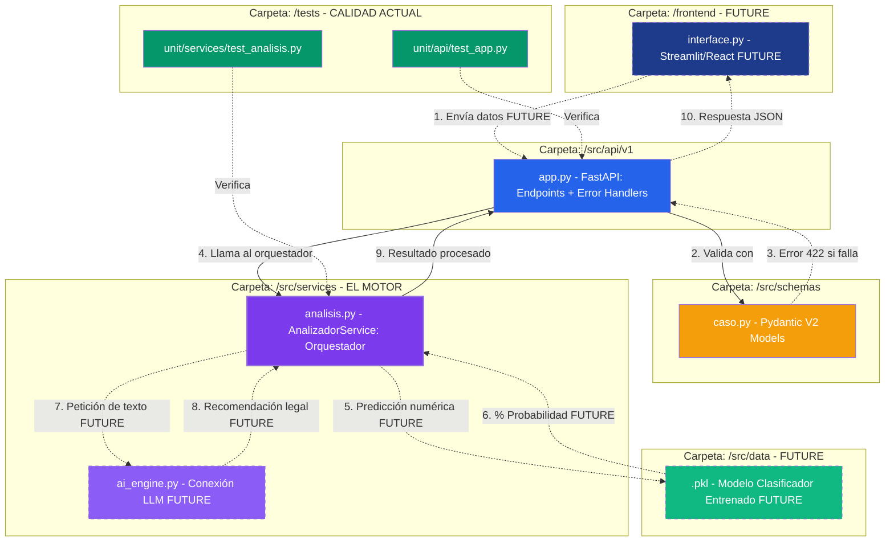

## 📂 Estructura del Proyecto

El código sigue una arquitectura modular y profesional, separando la lógica de negocio de la infraestructura y asegurando la calidad mediante una suite de pruebas externa al código fuente:

- **`.venv/`**: Entorno virtual de Python donde se gestionan las dependencias de forma aislada.
- **`src/`**: Carpeta principal que contiene el código fuente de la aplicación.
  - **`api/v1/`**: Versión 1 de la API. Contiene `app.py`, que registra los routers y configura FastAPI.
  - **`core/`**: Configuración transversal, gestión de variables de entorno (`config.py`) y excepciones personalizadas.
  - **`schemas/`**: Modelos de Pydantic para la validación de datos.
  - **`services/`**: Capa de orquestación. `analisis.py` procesa la lógica entre la API y los módulos específicos.
  - **`modules/`**: El cerebro del asistente. Contiene la lógica jurídica organizada por jurisdicciones (ej. `laboral/autonomos`).
  - **`utils/`**: Funciones de soporte reutilizables, como parseadores de archivos o herramientas de texto.
- **`tests/`**: Ubicada en la raíz para separar el código de producción del de pruebas.
  - **`unit/`**: Pruebas unitarias de funciones y reglas aisladas.
  - **`conftest.py`**: Configuración global de Pytest y definición de fixtures.
- **`requirements.txt`**: Listado de dependencias necesarias (FastAPI, Pytest, Uvicorn, etc.).
- **`.gitignore`**: Configuración para excluir archivos temporales, logs y el entorno virtual del repositorio.

---

## 🏗️ Arquitectura del Sistema

El siguiente diagrama describe la organización modular de JuezIA, detallando el flujo de datos desde la interfaz de usuario hasta los motores de decisión clínica y legal.



## 🚀 Guía de Ejecución

Puedes ejecutar este proyecto de dos formas: mediante un entorno local o usando Docker.

### Opción A: Entorno Local (Desarrollo)

#### 1. Configuración del Entorno Virtual

Es necesario crear un entorno para aislar las dependencias:

```bash
python3.11 -m venv .venv
```

Activación:
**Windows**:
`bash 
    .venv\Scripts\activate
    `
**macOS/Linux**:
`bash 
    source .venv/bin/activate
    `

#### 2. Instalación de Dependencias

Una vez activado el entorno, instala todos los paquetes necesarios utilizando el archivo de requerimientos:

```bash
pip install -r requirements.txt
```

### 3. Ejecución del Servidor

Para lanzar la API, ubicate en la raiz del proyecto JuezIA:

```bash
python -m uvicorn src.api.v1.app:app --reload
```

Puedes acceder a la documentación interactiva en:

- Swagger UI: http://127.0.0.1:8000/docs
- ReDoc: http://127.0.0.1:8000/redoc

### Opción B: Docker (Recomendado para Despliegue)

PDTE DE IMPLEMENTAR

## 📦 Snapshot de Leyes BOE

JuezIA indexa un conjunto curado de leyes del BOE usando el repositorio
[legalize-dev/legalize-es](https://github.com/legalize-dev/legalize-es)
como fuente. Los datos se almacenan en `data/leyes_db.json` y se publican
como artefacto en GitHub Releases para que todo el equipo consuma la misma versión.

### Cuándo se genera un snapshot

El workflow `snapshot_leyes.yml` se dispara en tres situaciones:

- **Automáticamente** cuando se hace push a `develop` con cambios en `data/leyes_relevantes.json` — es decir, cuando se añaden o eliminan leyes del listado curado.
- **El día 1 de cada mes** de forma programada, para incorporar las reformas que legalize-es haya consolidado durante el mes anterior.
- **Manualmente** desde la pestaña Actions de GitHub, usando el botón _Run workflow_, cuando se necesita forzar una regeneración sin modificar ningún fichero.

### Cómo generar manualmente un snapshot (sin guardar en Github Release)

Con la API lanzada, ejecutar desde la raiz del proycto: `python pipelines/boe/build_snapshot.py`

### Qué hace el workflow

push a develop (o trigger manual/programado)

- detecta cambios en data/leyes_relevantes.json
- arranca FastAPI en el runner
- ejecuta pipelines/boe/build_snapshot.py
- descarga cada ley desde legalize-es
- compara last_updated con la versión ya indexada
- reingestar solo si hay cambios o es una ley nueva
- publica data/leyes_db.json en GitHub Releases con tag automático v{YYYYMMDD-HHMM}

### Cómo usar un snapshot en local

Descarga el último release desde la pestaña **Releases** del repositorio
y coloca el fichero en `data/leyes_db.json`. La API lo usará automáticamente
al arrancar.

> **Nota:** Esta arquitectura es provisional. Cuando se integre ChromaDB,
> el snapshot pasará a ser un volumen exportado de la base de datos vectorial.
> El workflow y el script de importación se actualizarán en ese momento
> sin cambios en el resto del sistema.

## 🧪 Calidad de Código (CI)

Este proyecto utiliza **GitHub Actions** para validar cada cambio automáticamente.

- **Unit Tests:** Se ejecutan con `pytest`.
- **Coverage:** Se requiere un mínimo del 80% de cobertura de código para permitir el despliegue.
