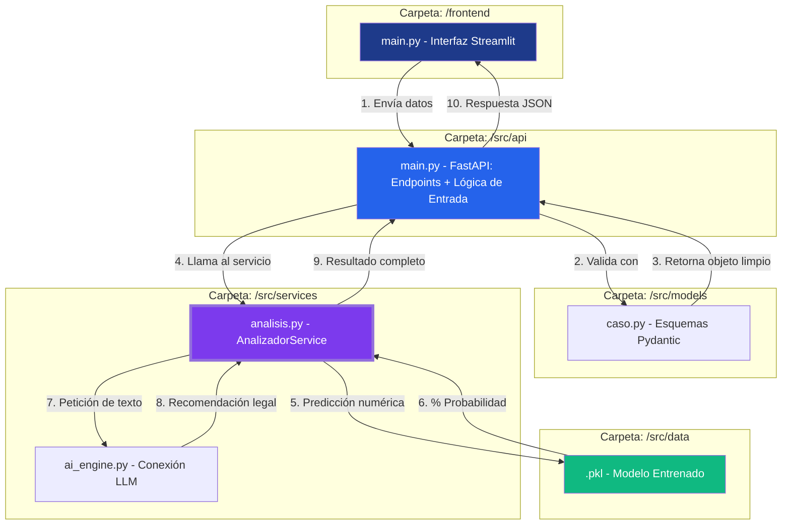

## 📂 Estructura del Proyecto

El código sigue una arquitectura modular basada en capas para facilitar el mantenimiento, la escalabilidad y la separación de responsabilidades:

* **src/api/main.py**: Punto de entrada de la aplicación. Define los endpoints (rutas) de la API y orquesta las llamadas a los servicios.
* **src/models/**: Contiene los modelos de datos (Pydantic) utilizados para la validación de entradas y salidas de la API.
* **caso.py**: Define el modelo CuestionarioAutonomo y otros esquemas relacionados.
* **src/services/**: Lógica de negocio de la aplicación.
* **analisis.py**: Contiene la clase AnalizadorService, encargada de calcular probabilidades y generar recomendaciones.
* **src/api/**: Capa de exposición de la API (controladores/endpoints).
* **__init__.py**: Archivos necesarios en cada carpeta para definir los paquetes de Python.
* **requirements.txt**: Listado de dependencias necesarias para ejecutar el proyecto.
---
## 🏗️ Arquitectura del Sistema
El siguiente diagrama describe la organización modular de JuezIA, detallando el flujo de datos desde la interfaz de usuario hasta los motores de decisión clínica y legal.


## 🚀 Guía de Ejecución

### 1. Configuración del Entorno Virtual


### 2. Instalación de Dependencias
Una vez activado el entorno, instala todos los paquetes necesarios utilizando el archivo de requerimientos:
```bash
pip install -r requirements.txt
```

### 3. Ejecución del Servidor
Para lanzar la API, ubicate en la raiz del proyecto JuezIA:
```bash
python -m uvicorn src.main:app --reload
```
Puedes acceder a la documentación interactiva en http://127.0.0.1:8000/docs

### 4. Poblado de Datos (Opcional)


### 5. Ejecución de Tests